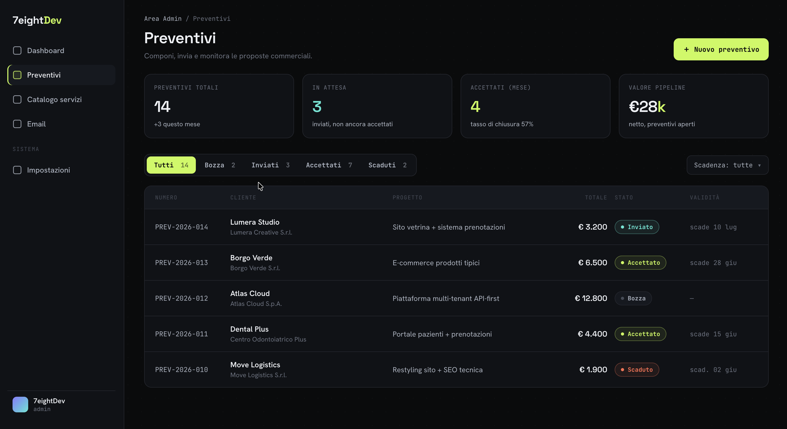
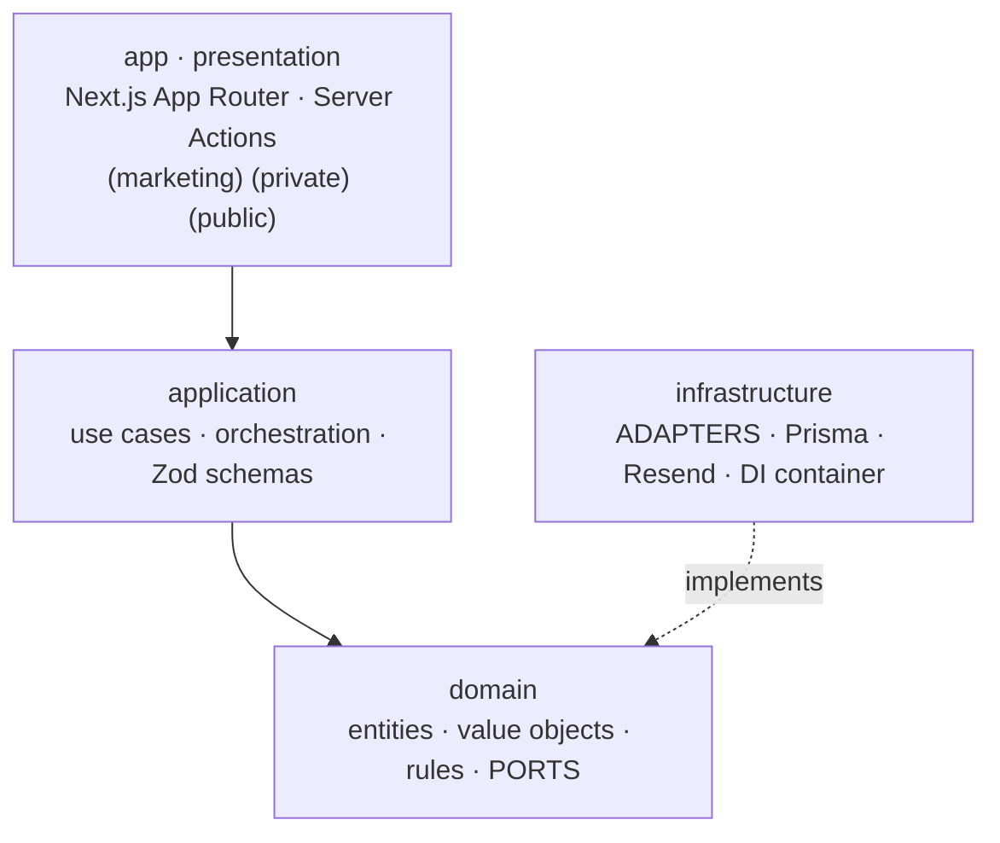

<div align="center">

# 7eightDev — Web Platform

Engineering-first digital studio — corporate site & B2B **Digital Quote System**, built on a strict Domain-Driven Design architecture and a no-compromise quality gate.

<br/>


<br/>



</div>

---

## Overview

7eightDev is an engineering-led web studio. We don't just build websites — we engineer digital assets that are **scalable, maintainable, and robust**. This repository hosts two products that share one codebase and one architectural discipline:

- **Corporate site** — a high-performance showcase of the studio's skills, mindset, and stack.
- **Digital Quote System** — a B2B tool to compose modular commercial proposals from a service catalog and share them with clients through secure, interactive links.

The codebase is the proof of the pitch: every layer is typed, every business rule is tested, and nothing reaches `main` without passing the full quality gate.

---

## Architecture

The project follows **Domain-Driven Design** with a strict, one-directional dependency flow. Business logic never depends on frameworks, databases, or delivery mechanisms — dependencies always point **inward**.



### Ports &amp; Adapters

The domain declares interfaces — `quote.repository.ts`, `quote-notification.port.ts` — and infrastructure provides interchangeable implementations:

| Port | Production adapter | Test / fallback adapter |
| --- | --- | --- |
| Quote repository | `PrismaQuoteRepository` | `InMemoryQuoteRepository` |
| Quote notification | `ResendQuoteNotificationAdapter` | `NullQuoteNotificationAdapter` |

Wiring happens in a single dependency-injection container (`infrastructure/container.ts`).

### Bounded contexts

| Context | Responsibility |
| --- | --- |
| **Quote** | Lifecycle (`draft → sent → accepted / rejected / expired`), line items, fiscal regime, money, acceptance, owner notifications. |
| **Catalog** | Reference data — modular service items with discriminated pricing (`fixed / range / on_request`) and billing (`one_time / recurring`) unions, composed into quotes. |

### Snapshot pattern

When a catalog item is added to a quote, its price and terms are **snapshotted** into the quote's line items. Later edits to the catalog never mutate quotes already issued — the proposal a client accepted is exactly the proposal they were sent.

---

## Tech Stack

| Layer | Technology |
| --- | --- |
| Framework | Next.js 16 (App Router) · React 19 |
| Language | TypeScript (strict mode) |
| Validation | Zod — single source of truth for runtime + compile-time contracts |
| UI | Tailwind CSS (semantic tokens) · Radix UI / shadcn · GSAP |
| Auth | Clerk — authentication + fail-closed admin allowlist |
| Database | PostgreSQL (Neon) via Prisma 7 |
| Email | Resend (port/adapter) · branded dark transactional templates |
| Testing | Jest — domain & application units |

---

## Features

**Corporate site** — a performance-focused landing page presenting the studio's engineering mindset, architecture-first approach, and technology stack.

**Digital Quote System**

- **Private dashboard** (`/admin`) — compose quotes from the Service Catalog, with control over billing, quantity, discounts, and per-quote optional sections (phases, terms, tech stack).
- **Service Catalog** — full CRUD admin on PostgreSQL, with relational discriminated unions guarded by `CHECK` constraints.
- **Fiscal regime** — VAT and a VAT-exempt occasional-service regime, handled at the domain level, with automatic VAT rate and explanatory notes.
- **Interactive public proposals** — each quote is published to a unique, unguessable URL (`/p/[uuid]`) where the client reviews and accepts.
- **Email workflow** — branded proposal delivery to clients, plus an owner alert on acceptance, behind a confirmation + validity gate.
- **Admin tooling** — status & due-date filters, a dev-only email preview/test studio, and a fail-closed Clerk admin allowlist.

---

## Quality Gate

> **Quality is a gate, not a goal.** Nothing reaches `main` without passing every check.

| Check | Command |
| --- | --- |
| Lint | `npm run lint` |
| Type check | `npm run typecheck` |
| Tests | `npm run test` |
| Production build | `npm run build` |

**Current status: 78/78 tests passing** across 10 suites — domain rules (money, status transitions, fiscal regime), application use cases (create / update / send / accept quote, catalog admin), and infrastructure mappers.

---

## Getting Started

**Prerequisites** — Node.js 20+, a PostgreSQL database (Neon recommended), and Clerk + Resend accounts.

```bash
# 1. Install dependencies (runs prisma generate via postinstall)
npm install

# 2. Configure environment
cp .env.example .env   # then fill in the values

# 3. Apply schema and seed reference data
npm run db:migrate
npm run db:seed

# 4. Start the dev server
npm run dev
```

Open <http://localhost:3000>.

### Environment variables

See `.env.example` for the full, documented list. In short:

| Variable | Purpose |
| --- | --- |
| `DATABASE_URL` / `DIRECT_URL` | Pooled (app) and direct (migrate/seed) Postgres connections |
| `NEXT_PUBLIC_CLERK_PUBLISHABLE_KEY` / `CLERK_SECRET_KEY` | Clerk authentication |
| `ADMIN_EMAILS` | Fail-closed admin allowlist for `/admin` |
| `RESEND_API_KEY` · `QUOTE_FROM_EMAIL` · `QUOTE_REPLY_TO` · `APP_BASE_URL` | Quote email delivery |
| `QUOTE_ACCEPT_NOTIFY_TO` | Owner alert on quote acceptance |

> If the Resend variables are absent, the app falls back to a **null notifier** — no email is sent, the outcome is logged. The system fails safe, never loud.

---

## Project Layout

```text
domain/          Entities, value objects, business rules, ports
application/     Use cases, Zod schemas, builders, server actions
infrastructure/  Prisma repositories, Resend adapter, mappers, DI container
app/             Next.js App Router — (marketing) / (private) / (public)
lib/             Shared utilities
prisma/          Schema & migrations
```

---

## Scripts

| Script | Description |
| --- | --- |
| `npm run dev` | Start the development server |
| `npm run build` | Production build |
| `npm run start` | Serve the production build |
| `npm run lint` | ESLint |
| `npm run typecheck` | TypeScript, no emit |
| `npm run test` | Jest test suite |
| `npm run db:migrate` | Apply Prisma migrations |
| `npm run db:seed` | Seed reference data |
| `npm run db:studio` | Open Prisma Studio |

---

<div align="center">

**7eightDev** · Engineering digital assets that last.

</div>
