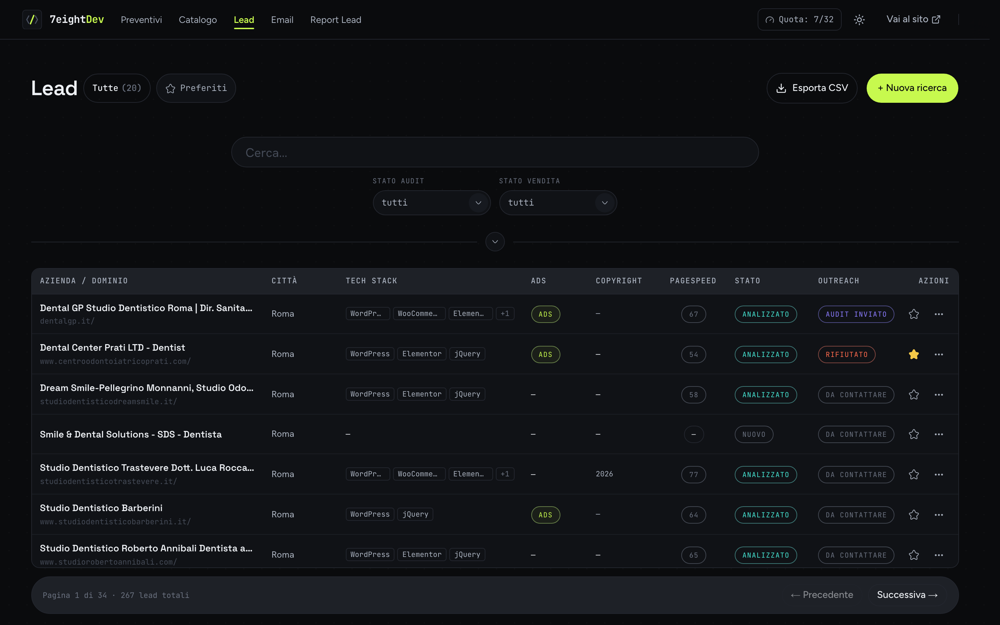
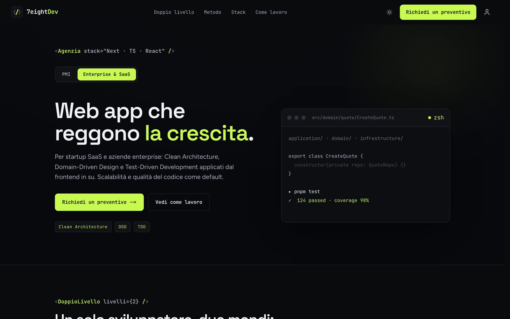
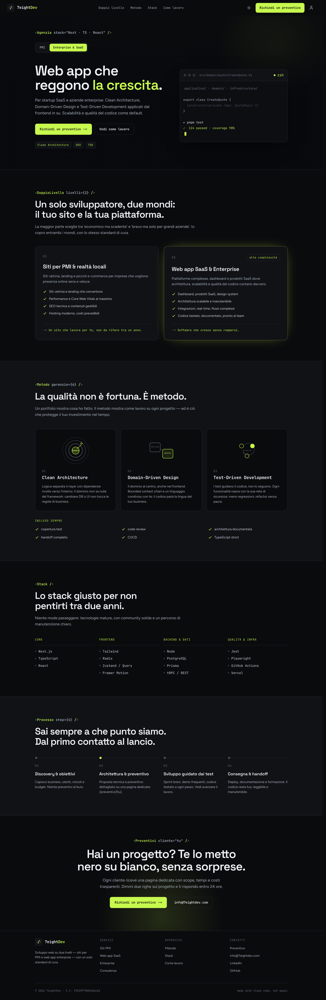
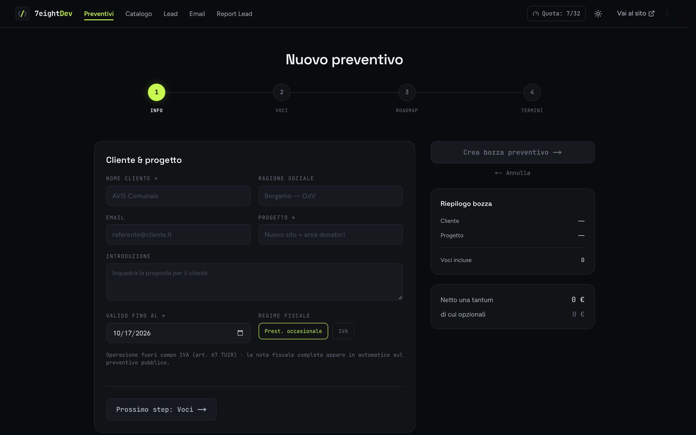
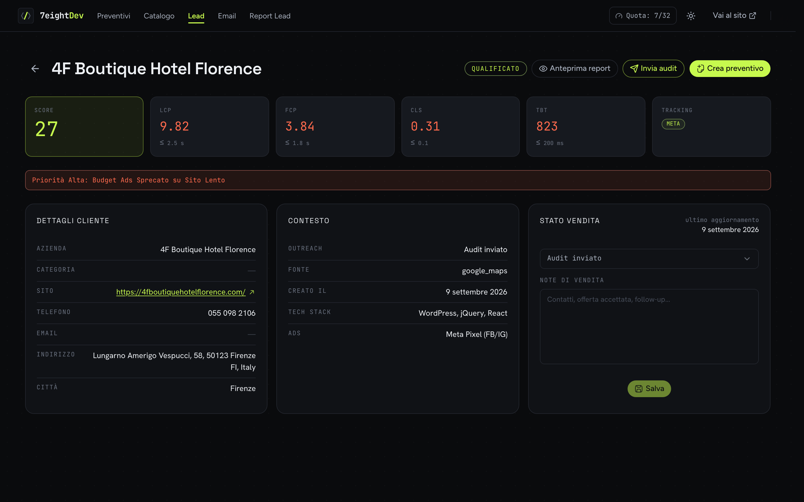
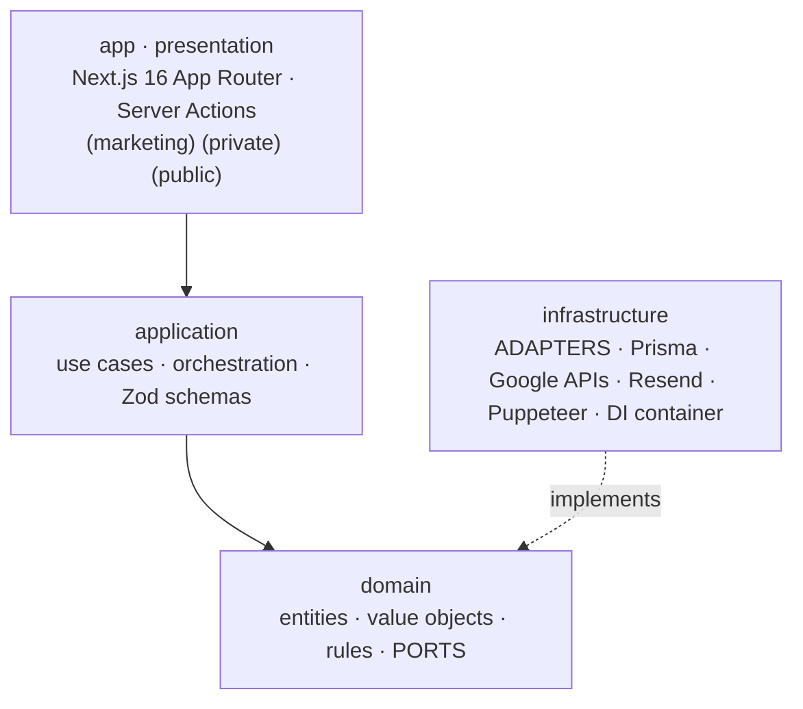

<div align="center">

# 7eightDev — Web Platform

Engineering-first digital studio. **Corporate site · Digital Quote System · Lead Generation Engine** — one codebase, one architectural discipline, and a no-compromise quality gate.

<br/>


<br/>



<sub><strong>Admin dashboard</strong> — the B2B lead-generation pipeline live: discovered prospects with their qualification score, audit status, and the value-first PDF one click away.</sub>

</div>

---

## The proof is in the pipeline

7eightDev doesn't just build websites. This repository is a **working proof of engineering competence**: three products shipped from a single TypeScript codebase, on a strict Domain-Driven Design architecture, secured by 563 tests, Playwright E2E suites, and visual regression baselines.

A CTO skimming this repo should be able to answer three questions in minutes:

1. **Is the architecture disciplined?** — Yes: bounded contexts, one-directional dependencies, ports & adapters, a single DI container.
2. **Are the products real?** — Yes: an interactive quote system with a full lifecycle, and an automated B2B lead-generation pipeline that calls billed Google APIs — under a self-imposed cost guard.
3. **Is quality taken seriously?** — Yes: tests are a **gate**, not a goal. Nothing reaches `main` without lint, type-check, 563 tests, and visual regression.

---

## Who's behind it

> Made with clean code, not magic.

7eightDev is an independent studio run by a single engineer: **Giuseppe Pesce** — 10+ years building production web software, based in Italy and working remotely across CET. One developer, two levels of work — **websites for SMBs** and **SaaS / enterprise web apps** — held to one standard of care. No hand-offs between agencies, no outsourcing: the person who architects the system is the one who writes, tests and ships it.

### My focus: method over hours

A portfolio shows what got built. The method shows how — and that is what protects an investment over time. My default is not "move fast and hope", it is:

- **Clean Architecture** — logic split into layers with dependencies pointing inward. The domain knows nothing about the framework: swapping the database or the UI never touches the business rules.
- **Domain-Driven Design, in the frontend too** — the domain sits at the centre, with clear bounded contexts and a language shared with the client. The code speaks the language of the business.
- **Test-Driven Development** — tests lead the code, they don't follow it. Every feature is born with its own safety net: fewer regressions, fearless refactoring.

### How I work

| Step | What happens |
|---|---|
| **01 · Discovery & goals** | Business, users, constraints and budget come first. No blind quotes. |
| **02 · Architecture & quote** | A technical proposal and a detailed quote, published to a dedicated link. |
| **03 · Test-driven development** | Short sprints, frequent demos, tested code at every step — you watch the work move. |
| **04 · Delivery & handoff** | Deploy, documentation and training. The code stays yours: readable and maintainable. |

**Always included:** test coverage · code review · documented architecture · complete handoff · CI/CD · TypeScript `strict`.

### My stack

| Layer | Tools |
|---|---|
| Core | Next.js · TypeScript · React |
| Frontend | Tailwind · Radix · Zustand / TanStack Query · Framer Motion |
| Backend & data | Node · PostgreSQL · Prisma · tRPC / REST |
| Quality & infra | Jest · Playwright · GitHub Actions · Vercel |

No passing fads: mature technologies, solid communities, a clear maintenance path. The exact versions this repository pins are in [Tech Stack](#tech-stack).

**Based in** Italy · working remotely (CET) — **Find me:** [LinkedIn](https://www.linkedin.com/in/giuseppe-pesce-dev/) · [GitHub](https://github.com/7eightDev) · [info@7eightdev.com](mailto:info@7eightdev.com)

---

## What we build

### Corporate site — the pitch as product

A performance-focused landing page that demonstrates the studio's stack live: WebGL Aurora background with a reduced-motion fallback, GSAP-driven reveals, an animated terminal, and a PMI/Enterprise toggle backed by a full quote request flow.

| Above the fold | The full narrative |
|---|---|
|  |  |
| **Hero** — WebGL Aurora background, animated terminal, and the PMI / Enterprise toggle that starts a real quote request. | **Full landing page** — offers, process, stack, and credentials in one continuous, GSAP-choreographed scroll. |

### Digital Quote System — compose, publish, accept

A B2B tool that composes modular commercial proposals from a service catalog and publishes them to secure, unguessable client links.

- **Lifecycle as a state machine** — `draft → sent → accepted | rejected | expired`, every transition guarded, terminal states have no exits.
- **Snapshot pattern** — catalog values are copied into quote line items at composition time; later catalog edits never mutate an issued proposal.
- **Fiscal regimes at the domain level** — VAT and occasional-service regime (art. 67 TUIR: zero VAT rate, 20% witholding computed admin-side, never shown to the client).
- **Interactive public proposals** — the client toggles optional items, sees a live total, and accepts with name + IP recorded; the owner gets an email alert that never fails the acceptance.
- **Drag-and-drop composer** — multi-step editor with persistent save, discounts, quantity/unit, and three billing models (`one_time` / `recurring` / `on_demand`).

| Compose, admin side | The client's view |
|---|---|
|  |  |
| **Drag-and-drop composer** — multi-step editor with catalog picker, quantity/unit, discounts, and three billing models. | **Interactive public proposal** — the client toggles optional items, watches the total update live, and accepts with name + IP. |

### Lead Generation Engine — from search query to sales pipeline

An automated B2B prospecting system that turns a Google Maps category/location query into qualified, outreach-ready leads — with a free, data-driven audit as the first touch.

```
Google Places discovery → PageSpeed analysis → qualification → PDF audit → value-first outreach
```

- **Discovery** — Google Places Text Search (paginated, field-mask driven, retry + quota guard), powering a search form with Places Autocomplete.
- **PageSpeed intelligence** — performance scoring (score + LCP / FCP / CLS / TBT, mobile strategy) with a smart 60s timeout for slow sites.
- **Qualification rule** — a score < 50 is a commercial opportunity. The pipeline doesn't pitch slow sites the same way it pitches nothing.
- **HTML heuristics** on each prospect's website — tech-stack detection (WordPress, Wix, Shopify, React…), footer copyright year as a staleness signal, and ad-tracker detection (Google Ads / Meta Pixel / GTM) powering a **waste-budget estimate**.
- **Economic-impact model** — a cited ~20% conversion loss per second of LCP over 2.5s (capped at 80%), computed into scenario tables for €500 / €1 000 / €2 000 monthly ad budgets.
- **Fire-and-forget jobs** — the pipeline persists a `running` job, runs without awaiting, and recovers stale jobs after 20 min; re-runs re-qualify existing leads without duplicating.
- **Value-first outreach** — an in-house branded PDF audit report (Puppeteer, A4, dark theme) is generated and emailed before any sales pitch. Show the numbers first.
- **Quote integration** — from any qualified lead, one click opens the quote composer pre-populated with the right catalog services.

| Lead intelligence | Deep-dive analysis |
|---|---|
|  |  |
| **Lead table** — every discovered prospect with qualification score, pipeline status, and the re-run entry point. | **Lead detail** — PageSpeed scores (LCP / FCP / CLS / TBT), detected tech stack, and the waste-budget estimate. |

---

## Architecture

**Domain-Driven Design / Hexagonal** with a strict, one-directional dependency flow. Dependencies always point inward; the domain never imports a framework, a database, or a delivery mechanism.


```mermaid
flowchart TD
    A["app · presentation<br/>Next.js 16 App Router · Server Actions<br/>(marketing) (private) (public)"]
    B["application<br/>use cases · orchestration · Zod schemas"]
    C["domain<br/>entities · value objects · rules · PORTS"]
    D["infrastructure<br/>ADAPTERS · Prisma · Google APIs · Resend · Puppeteer · DI container"]

    A --> B --> C
    D -. implements .-> C
```

| Layer | Responsability | Examples |
|---|---|---|
| `domain/` | Pure types, rules, value objects, ports | money (integer cents, never float), `.status.ts` state machine, `fiscal.ts`, `lead.score.ts` |
| `application/` | Use cases as plain functions over injected ports | Zod `safeParse` on every untrusted input, discriminated `{ok,error}` results instead of throws |
| `infrastructure/` | Adapters + composition root | `PrismaQuoteRepository`, `GooglePlacesLeadDiscovery`, `PuppeteerReportAdapter`, `container.ts` |
| `presentation/` | React components, zero data access | `quote-composer.tsx`, `lead-table.tsx`, pure filters unit-tested |
| `app/` | Next.js App Router route groups | `(marketing)`, `(private)/admin`, `(public)/p/[uuid]`, `sign-in` |

### Bounded contexts & patterns

| Pattern | Where | Why it matters |
|---|---|---|
| **Snapshot** | Catalog → quote line items | A proposal the client accepted is exactly the proposal they were sent |
| **State machine** | Quote lifecycle | Invalid transitions are impossible by construction, enforced by `assertTransition` |
| **Quota guard** | Every billed Google call | A cost control that is fail-closed and shared across serverless instances |
| **Fire-and-forget** | Lead pipeline | `running` job persisted first; UI polls; stale jobs are reconciled to `failed` |
| **Capability token** | `/p/[uuid]` | The UUID is the authorization — knowing the link is the permission |

---

## Lead Generation Engine — cost-protected

The pipeline calls **billed** Google APIs (Places Text Search, Places Autocomplete). That's a bug until it's a board decision, so a `DailyQuotaGuard` sits between the app and Google:

- One **bucket per billed SKU** (`places-text-search` 32/day, `places-autocomplete` 322/day — the free monthly allowance divided by 31, so the cap can't be exceeded even on 31-day months).
- Counters live in Postgres (`api_quota_counters`) behind a `QuotaStore` seam — a single atomic `INSERT … ON CONFLICT DO UPDATE`, so concurrent serverless invocations never lose a call.
- **Fail-closed**: if the store is unreachable, the call is denied. Blocked beats uncounted.
- **Check-then-increment-on-success**: a failed or zero-result Google call — billed under the free "zero results" SKU — never consumes quota.
- A live badge in the admin header polls the counter every 15 s: amber near the limit, red when exhausted.
- PageSpeed Insights is free and deliberately **not** gated.

---

## Tech Stack

| Layer | Technology |
|---|---|
| Framework | Next.js 16.2.9 (App Router) · React 19 · TypeScript `strict` |
| Validation | **Zod 4** — single source of truth for runtime + compile-time contracts |
| Database | PostgreSQL (Neon, EU) via **Prisma 7** + driver adapter, client generated into the repo |
| Auth | Clerk — `proxy.ts` middleware, fail-closed private area |
| UI | Tailwind CSS v4 (semantic tokens) · Radix UI / shadcn · GSAP · framer-motion · WebGL (`ogl`) · `@dnd-kit` |
| Email | Resend — branded dark-mode transactional HTML templates |
| PDF | Puppeteer 25 — in-house HTML→PDF audit reports (adapter-swappable) |
| Testing | Jest 30 (563 tests, node + jsdom configs) · Playwright 1.63 (E2E + visual regression) |
| CI / Deploy | GitHub Actions (ephemeral Postgres) · Vercel (`fra1`) |

---

## The Quality Gate

> **Quality is a gate, not a goal.** Nothing reaches `main` without every check passing.

| Check | Command |
|---|---|
| Lint | `npm run lint` |
| Type check | `npm run typecheck` |
| Unit + component tests | `npm run test` · `npm run test:presentation` |
| E2E + visual regression | `npx playwright test` |
| Production build | `npm run build` |

**Current status: 563/563 tests passing** across 57 suites — domain rules (money, status transitions, fiscal regime, lead scoring, impact model), application use cases, infrastructure adapters/mappers, and React component tests.

### Testing strategy

- **Playwright matrix × 4 form factors** — Desktop 1280×800, Tablet 768×1024, Mobile Safari 375×667, Mobile Chrome 375×812; breakpoints imported from a single source of truth (`presentation/lib/breakpoints.ts`).
- **Visual regression with committed baselines** — deterministic captures (`animations: disabled`, WebGL Aurora replaced by a static div under reduced motion, quota badge intercepted with a fixture) that ran against an ephemeral Postgres seeded with deterministic `fixture` data (40 leads, 29 analyses, 16 quotes).
- **Human-in-the-loop snapshot updates** — `update-snapshots` is never run in CI.
- **Ghost-scroll overflow audit** — a script that hunts horizontal overflow across every viewport and every route, and caught a real tablet bug that shipped as a regression spec.

---

## Getting Started

**Prerequisites** — Node.js 24, a PostgreSQL database (Neon recommended), Clerk + Resend accounts.

```bash
# 1. Install dependencies (postinstall runs prisma generate)
npm install

# 2. Configure environment
cp .env.example .env   # then fill in the values

# 3. Apply schema and seed reference data
npm run db:migrate
npm run db:seed

# 4. Start the dev server (use dev:clean after any prisma generate — Turbopack
#    caches the stale client and would silently break the lead pipeline)
npm run dev
```

Open <http://localhost:3000>.

### Environment variables

See `.env.example` for the full, documented list. In short:

| Variable | Purpose |
|---|---|
| `DATABASE_URL` / `DIRECT_URL` | Pooled (app) and direct (migrate/seed) Postgres connections |
| `NEXT_PUBLIC_CLERK_PUBLISHABLE_KEY` / `CLERK_SECRET_KEY` | Clerk authentication |
| `ADMIN_EMAILS` | Fail-closed admin allowlist for `/admin` |
| `RESEND_API_KEY` · `QUOTE_FROM_EMAIL` · `QUOTE_REPLY_TO` · `APP_BASE_URL` | Quote + lead email delivery |
| `GOOGLE_PLACES_DAILY_QUOTA_LIMIT` / `GOOGLE_AUTOCOMPLETE_DAILY_QUOTA_LIMIT` | Daily quota caps (defaults: 32 / 322) |

> If the Resend variables are absent, the app falls back to a **null notifier** — no email is sent, the outcome is logged. The system fails safe, never loud.

---

## Project Layout

```text
domain/          Entities, value objects, business rules, ports
application/     Use cases, Zod schemas, builders, server actions
infrastructure/  Adapters (Prisma, Google, Resend, Puppeteer), mappers, DI container
presentation/    React components — features + ui (shadcn), zero data access
app/             Next.js App Router — (marketing) / (private) / (public) / sign-in
e2e/             Playwright specs, helpers, committed screenshot baselines
prisma/          Schema, migrations, deterministic fixtures
docs/            Development guides, QA roadmap, screenshots
```

---

## Scripts

| Script | Description |
|---|---|
| `npm run dev:clean` | Remove `.next` and start dev (required after `prisma generate`) |
| `npm run build` / `start` | Production build / serve |
| `npm run lint` / `typecheck` | ESLint 9 / `tsc --noEmit` |
| `npm run test` | Jest 30 suite (domain, application, infrastructure) |
| `npm run test:presentation` | Jest jsdom suite (React components) |
| `npx playwright test` | E2E + visual regression matrix |
| `npm run db:migrate` / `db:seed` | Prisma migrations / deterministic seeding |

---

<div align="center">

**7eightDev** · Engineering digital assets that last.

</div>